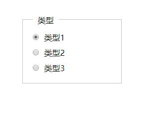

>子元素浮动后，撑开父元素

使用`overflow:hidden`来清除浮动
```html
<div id="all1">

<div id="left1">1</div>

<div id="left2">1</div>
</div>
```
```css
.left1 {float:left;}
.left2 {float:left;}
.all1{ overflow:hidden;}
```

>绝对定位 position absolute

绝对定位经常使用`top`等样式来定位元素的位置，绝对定位的元素的位置相对于最近的已定位祖先元素，已定位祖先元素是指定位为absolute、relative、fixed的元素

```html
<div style="width:200px;margin: 40px">
  <div class="checkgroup">
    <span>类型</span>
    <div class="checkitem">
        <p>类型1</p>
        <input type="radio" name="Type" value="" data-key="1" checked="">
    </div>
    <div class="checkitem">
        <p>类型2</p>
        <input type="radio" name="Type" data-key="2" value="">
    </div>
    <div class="checkitem">
        <p>类型3</p>
        <input type="radio" name="Type" data-key="3" value="">
    </div>
  </div>
</div>
```

```css
.checkitem p, .checkitem input {
    display: inline-block;
}

.checkitem input {
    float: left;
    margin-right: 10px;
}

.checkgroup {
    border: 1px solid #C3C3C3;
    padding: 25px 20px 10px 20px;
    margin-bottom: 20px;
    position: relative;
}

.checkgroup > span {
    position: absolute;
    top: -10px;
    z-index: initial;
    background: white;
    padding: 0px 10px;
}
```

