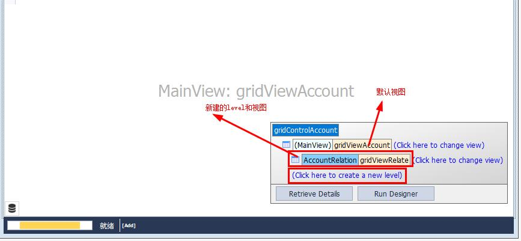

# 数据绑定
## 简单绑定

```csharp
DataTable value;
gridControlAccount.DataSource =value;
```
## 主从表
* 定义主从表视图    
主表视图就用默认的GridView
从表视图是添加一个Level，在Level中新建一个视图

* 数据绑定(通过DataRelation)

```csharp
DataSet dsAB ;
DataRelation dRelation = new DataRelation("AccountRelation", dsAB.Tables[0].Columns["F_AccountNumber"], dsAB.Tables[1].Columns["F_AccountNumber"]);
dsAB.Tables[0].ChildRelations.Add(dRelation);
gridControlAccount.DataSource = dsAB.Tables[0];
//给gridViewRelate创建列，以便能自定义各个列
//gridViewRelate是从表视图，主表视图在数据绑定的时候已经创建好列了
gridViewRelate.PopulateColumns(dsAB.Tables[1]);
```
**注意：** 在数据绑定的时候，DataRelation的名称要和新建的Level名称一样
## 列合并

## 行下表
## 分组

# 常用属性配置
## 搜索功能
```csharp
gridViewGroup.OptionsFind.AllowFindPanel = true;
gridViewGroup.OptionsFind.AlwaysVisible = true;
//FindFilterColumns是要查询的列，有多个列时要用分号隔开，如果是要搜索所有列，直接打*号
gridViewGroup.OptionsFind.FindFilterColumns = "F_VDGroupID;F_VDGroupName";
gridViewGroup.OptionsFind.FindNullPrompt = "输入分组ID或者名称";
```
## 是否可编辑
```csharp
//整体编辑属性
gridViewCurrent.OptionsBehavior.Editable = false;
//某一列编辑属性
gridViewCurrent.Columns["F_State"].OptionsColumn.AllowEdit = true;
//某一列、某一行或者某一行的某一列的编辑属性
private void gridViewCurrent_ShowingEditor(object sender, CancelEventArgs e)
{
    string colName = gridViewCurrent.FocusedColumn.FieldName;
    if (colName != "F_State")
    {
        e.Cancel = true;
    }
    DataRow row = gridViewCurrent.GetDataRow(gridViewCurrent.FocusedRowHandle);
    if (row != null)
    {
        e.Cancel = true;
    }
}
```
## 时间格式
```csharp
gridViewCurrent.Columns["F_Time"].DisplayFormat.FormatType = DevExpress.Utils.FormatType.DateTime;
gridViewCurrent.Columns["F_Time"].DisplayFormat.FormatString = "yyyy/MM/dd HH:mm:ss";
```
## 符合条件行变色
>通过事件来实现
```csharp
//有两个事件可以实现
//事件1
private void gridView1_RowCellStyle(object sender, DevExpress.XtraGrid.Views.Grid.RowCellStyleEventArgs e)
{
    if (e.RowHandle >= 0)
    {
        e.Appearance.BackColor = Color.Red;
    }
}
//事件2
private void gridView1_CustomDrawCell(object sender, DevExpress.XtraGrid.Views.Grid.RowCellStyleEventArgs e)
{
    if (e.RowHandle >= 0)
    {
        e.Appearance.BackColor = Color.Red;
    }
}
```

>通过GridFormatRule来实现
```csharp
//在有UnboundColumn的情况下也能用，以下的gridColumnNum就是一个UnboundColumn，RelateNum是该列的FieldNam
GridFormatRule rule = new GridFormatRule();
//指定应用到哪一列
rule.Column = gridColumnNum;
//应用到一整行，这时候可以不指定列
rule.ApplyToRow = true;
rule.Rule = new FormatConditionRuleExpression()
{
    Expression = "[RelateNum] > 0",
    PredefinedName = "Green Fill, Green Text"
};
gridViewMeter.FormatRules.Add(rule);
```

# 给新增行的某一列设置默认值
```csharp
//允许新增行
gridViewDetail.OptionsBehavior.AllowAddRows = DefaultBoolean.True;
//设置新增行位置
gridViewDetail.OptionsView.NewItemRowPosition = NewItemRowPosition.Top;
//点击新增行时，会触发该事件
private void gridViewDetail_FocusedRowChanged(object sender, FocusedRowChangedEventArgs e)
{
    //新增行的RowHandle是小于0的，当编辑完成新增到GridView中时才会变更为大于0的一个值
    if (e.FocusedRowHandle < 0)
    {
        //AddNewRow方法触发InitNewRow事件
        gridViewDetail.AddNewRow();
    }
}

private void gridViewDetail_InitNewRow(object sender, InitNewRowEventArgs e)
{
    GridView view = sender as GridView;
    //给某一列赋初始值
    view.SetRowCellValue(e.RowHandle, view.Columns["F_OperationAction"], "ShutDown");
    view.SetRowCellValue(e.RowHandle, view.Columns["F_OperationMode"], "Manual");
}
```

# 过滤器
 [博客通道](https://blog.csdn.net/hacky_way/article/details/7753890)
## BetweenOperator
> 10<=value<=100
```csharp
BetweenOperator btween = new BetweenOperator("value", 10, 100);
GridView1.ActiveFilterCriteria = btween;
```

## BinaryOperator
> name like 'fuhai%'
 ```csharp
BinaryOperator binary = new BinaryOperator("name","fuhai%",BinaryOperatorType.Like);
GridView1.ActiveFilterCriteria = binary;
```

> value>=10
 ```csharp
BinaryOperator binary = new BinaryOperator("value",10,BinaryOperatorType.GreaterOrEqual);
GridView1.ActiveFilterCriteria = binary;
```

## GroupOperator 
>value<=10 or value >=100
 ```csharp
BinaryOperator lessthanten = new BinaryOperator("value",10,BinaryOperatorType.LessOrEqual);
BinaryOperator bigthanhun = new BinaryOperator("value", 100, BinaryOperatorType.GreaterOrEqual);
GroupOperator op = new GroupOperator(GroupOperatorType.Or, lessthanten, bigthanhun);
GridView1.ActiveFilterCriteria = op;
```
## InOperator 
> age in [1,50,96]
 ```csharp
int [] ageList=new int[]{1,50,96};
CriteriaOperator filter = new InOperator("age",ageList);
GridView1.ActiveFilterCriteria = filter;
```

## NotOperator  
> value!=10
 ```csharp
CriteriaOperator filter = new NotOperator("value",10);
GridView1.ActiveFilterCriteria = filter;
```
## NullOperator
>name is null
 ```csharp
CriteriaOperator filter = new NullOperator("name");
GridView1.ActiveFilterCriteria = filter;
```

