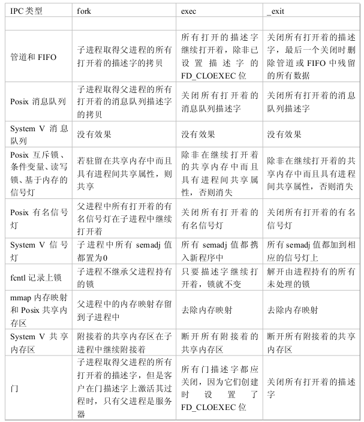

# 1 进程间通信IPC(Inter-Process Communication)

## 1.1 放图

## 管道(PIPE)
## 命名管道(FIFO)
## 消息队列(MessageQueue)
## 信号量(semaphore)

## 信号
## 套接字(socket)
## 共享内存(shared memory)
### 常见使用场景
    windows中:sql连接方式中就有一种方式是使用内存共享
### 实现方式
**文件映射（File Mapping）**

**互斥量（Mutex）**
## 文件和记录锁定。 
    为避免两个进程间同时要求访问同一共享资源而引起访问和操作的混乱,在进程对 
    共享资源进行访问前必须对其进行锁定,该进程访问完后再释放。这是UNIX为共享 
    资源提供的互斥性保障。

## 进程通讯总结
**管道:** 速度慢，容量有限，只有父子进程能通讯  
**FIFO：** 任何进程间都能通讯，但速度慢    
**消息队列：** 容量受到系统限制，且要注意第一次读的时候，要考虑上一次没有读完数据的问题    
**信号量：** 不能传递复杂消息，只能用来同步    
**共享内存区：** 能够很容易控制容量，速度快，但要保持同步，比如一个进程在写的时候，另一个进程要注意读写的问题，相当于线程中的线程安全，当然，共享内存区同样可以用作线程间通讯，不过没这个必要，线程间本来就已经共享了同一进程内的一块内存   
**套接字(socket):** 套解字也是一种进程间通信机制，与其他通信机制不同的是，它可用于不同机器间的进程通信。    
**信号:** 信号是一种比较复杂的通信方式，用于通知接收进程某个事件已经发生。
