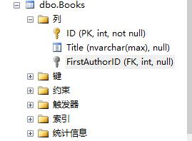

# 使用

## code first

>创建模型，context，注册context 

```csharp
public class Book
{
    [ScaffoldColumn(false)]
    [DatabaseGenerated(DatabaseGeneratedOption.Identity)]
    public int ID { get; set; }
    public string Title { get; set; }
    //导航
    public Author FirstAuthor { get; set; }
}
public class Author
{
    public int ID { get; set; }
    public string Name { get; set; }
    //导航
    public virtual ICollection<Book> BooksAsFirstAuthor { get; set; }
}

services.AddDbContext<BloggingContext>(options => {
    options.UseSqlServer("Data Source=.;Initial Catalog=Blogging;Integrated Security=True");
});
```

>初始化数据库

安装`Microsoft.EntityFrameworkCore.Tools`,需要用到这个包的命令，编译一次项目才能使用命令

程序包管理器控制台

工具->Nuget包管理器->程序包管理器控制台

使用命令`Add-Migration Init`、`update-database Init`初始化数据库

```cmd
PM> Add-Migration Init
Build started...
Build succeeded.
To undo this action, use Remove-Migration.
PM> update-database Init
Build started...
Build succeeded.
Done.
PM> 
```

>数据库
```csharp
public class Book
{
    public int ID { get; set; }
    public string Title { get; set; }
    public Author FirstAuthor { get; set; }
}

public class Author
{
    public int ID { get; set; }
    public string Name { get; set; }
    public virtual ICollection<Book> Books{ get; set; }
}
```

Book.FirstAuthor是引用导航

Author.Books是集合导航

Book.FirstAuthor 是 (Author.Books的反向导航属性，反之亦然)




可以看到上面模型中并没有指明外键，在使用导航的情况下就自动添加上了外键`FirstAuthorID`,这个是因为使用了[阴影外键属性](https://docs.microsoft.com/zh-cn/ef/core/modeling/relationships?tabs=fluent-api%2Cfluent-api-simple-key%2Csimple-key#no-foreign-key-property)

>使用

新增一条book记录

```csharp
Author author = BloggingContext.Authors.FirstOrDefault();
Book book = new Book
{
    Title = "book1",
    FirstAuthor = author
};
await BloggingContext.Books.AddAsync(book);
await BloggingContext.SaveChangesAsync();
```

查询book时包含外键对象

```csharp
await BloggingContext.Books.Include(m => m.FirstAuthor).FirstOrDefaultAsync();
```


>ForeignKey


上面的方式使用的阴影外键，在模型中不可见，需要把外键连接对象一起查询出来才能看到外键id，

当需要显示的使用外键时候，就需要使用`ForeignKey`

```csharp
public class Book
{
    [ScaffoldColumn(false)]
    [DatabaseGenerated(DatabaseGeneratedOption.Identity)]
    public int ID { get; set; }
    public string Title { get; set; }

    public int FirstAuthorID { get; set; }
    [ForeignKey("FirstAuthorID")]
    //导航
    public Author FirstAuthor { get; set; }
}
```

```csharp
public class Book
{
    [ScaffoldColumn(false)]
    [DatabaseGenerated(DatabaseGeneratedOption.Identity)]
    public int ID { get; set; }
    public string Title { get; set; }
    [ForeignKey("FirstAuthor")]
    public int FirstAuthorID { get; set; }
    //导航
    public Author FirstAuthor { get; set; }
}
```

如上，
ForeignKey可以用在外键上，用在外键上时指向导航名称，
也可以用在导航上，用在导航上时指向外键名称

>InverseProperty

反向导航，作用是在有多个相同的外键时，使用反向导航来确认导航的关系

```csharp
public class Book
{
    [ScaffoldColumn(false)]
    [DatabaseGenerated(DatabaseGeneratedOption.Identity)]
    public int ID { get; set; }
    public string Title { get; set; }
    public int FirstAuthorID { get; set; }
    [InverseProperty("BooksAsFirstAuthor")]
    public Author FirstAuthor { get; set; }
    [InverseProperty("BooksAsSecondAuthor")]
    public Author SecondAuthor { get; set; }
}
public class Author
{
    public int ID { get; set; }
    public string Name { get; set; }
    public virtual ICollection<Book> BooksAsFirstAuthor { get; set; }
    public virtual ICollection<Book> BooksAsSecondAuthor { get; set; }
}
```

如上，Book上有两个导航`FirstAuthor`和`SecondAuthor`，通过反向导航对应上Author的两个导航属性`BooksAsFirstAuthor`和`BooksAsFirstAuthor`，在查询Author时，就能根据这个关系，把FirstAuthor等于Author的ID的Book放入到BooksAsFirstAuthor中,把SecondAuthor等于Author的ID的Book放入到BooksAsSecondAuthor中.

反向导航也能在Author中使用，只需要在一方使用就行了。

InverseProperty和ForeignKey的作用并不相同，InverseProperty只是指定导航的关系，定义外键还是要使用ForeignKey，这里还是用的阴影外键，也可以使用ForeignKey来显示的定义外键。


### IModelCacheKeyFactory

>IModelCacheKeyFactory

实现一个model映射多张表


# 异常

>An item with the same key has already been added

这个是字典的键值重复了，最后查找到的问题是，使用存储过程查找数据的时候，有几列是没有列名的，ef core会根据列名来创建一个字段，映射到类中，这里有几列没有列名，导致创建字典的时候发生异常

也可能是多次配置sql连接字符串导致的


