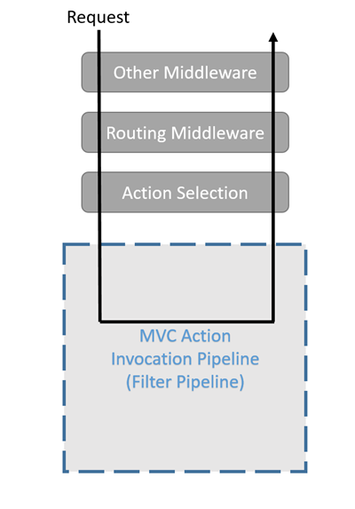

# 1 mvc

## 1.1 概念

>mvc概念

模型(model)、视图(view)、控制器(controller)
## 1.2 控制器

### 1.2.1 ControllerBase

`ControllerBase`是控制器基类，mvc控制器和api控制器都是继承自`ControllerBase`
```csharp
//
// 摘要:
//     A base class for an MVC controller without view support.
[Controller]
public abstract class ControllerBase
{
    protected ControllerBase();

    //
    // 摘要:
    //     Gets the Microsoft.AspNetCore.Routing.RouteData for the executing action.
    public RouteData RouteData { get; }
    //
    // 摘要:
    //     Gets the Microsoft.AspNetCore.Http.HttpResponse for the executing action.
    public HttpResponse Response { get; }
    //
    // 摘要:
    //     Gets the Microsoft.AspNetCore.Http.HttpRequest for the executing action.
    public HttpRequest Request { get; }
    public ProblemDetailsFactory ProblemDetailsFactory { get; set; }
    //
    // 摘要:
    //     Gets or sets the Microsoft.AspNetCore.Mvc.ModelBinding.Validation.IObjectModelValidator.
    public IObjectModelValidator ObjectValidator { get; set; }
    //
    // 摘要:
    //     Gets the Microsoft.AspNetCore.Mvc.ModelBinding.ModelStateDictionary that contains
    //     the state of the model and of model-binding validation.
    public ModelStateDictionary ModelState { get; }
    //
    // 摘要:
    //     Gets or sets the Microsoft.AspNetCore.Mvc.ModelBinding.IModelBinderFactory.
    public IModelBinderFactory ModelBinderFactory { get; set; }
    //
    // 摘要:
    //     Gets or sets the Microsoft.AspNetCore.Mvc.ModelBinding.IModelMetadataProvider.
    public IModelMetadataProvider MetadataProvider { get; set; }
    //
    // 摘要:
    //     Gets the Microsoft.AspNetCore.Http.HttpContext for the executing action.
    public HttpContext HttpContext { get; }
    //
    // 摘要:
    //     Gets or sets the Microsoft.AspNetCore.Mvc.ControllerContext.
    //
    // 言论：
    //     Microsoft.AspNetCore.Mvc.Controllers.IControllerActivator activates this property
    //     while activating controllers. If user code directly instantiates a controller,
    //     the getter returns an empty Microsoft.AspNetCore.Mvc.ControllerContext.
    [ControllerContext]
    public ControllerContext ControllerContext { get; set; }
    //
    // 摘要:
    //     Gets or sets the Microsoft.AspNetCore.Mvc.IUrlHelper.
    public IUrlHelper Url { get; set; }
    //
    // 摘要:
    //     Gets the System.Security.Claims.ClaimsPrincipal for user associated with the
    //     executing action.
    public ClaimsPrincipal User { get; }
}

```

### 1.2.2 api 控制器

```csharp
[Route("api/[controller]")]
[ApiController]
public class ValuesController : ControllerBase
{
}
```

### 1.2.3 mvc 控制器

mvc控制器是继承自`Controller`，而`Controller`是继承自`ControllerBase`,`Controller`相对于`ControllerBase`多了一些视图相关的字段和方法。

```csharp
public class HomeController : Controller
{
    private readonly ILogger<HomeController> _logger;

    public HomeController(ILogger<HomeController> logger)
    {
        _logger = logger;
    }

    public IActionResult Index()
    {
        return View();
    }
}
```

`Controller`
```csharp
//
// 摘要:
//     A base class for an MVC controller with view support.
public abstract class Controller : ControllerBase, IActionFilter, IFilterMetadata, IAsyncActionFilter, IDisposable
{
    protected Controller();

    //
    // 摘要:
    //     Gets or sets Microsoft.AspNetCore.Mvc.ViewFeatures.ITempDataDictionary used by
    //     Microsoft.AspNetCore.Mvc.ViewResult.
    public ITempDataDictionary TempData { get; set; }
    //
    // 摘要:
    //     Gets the dynamic view bag.
    [Dynamic]
    public dynamic ViewBag { get; }
    //
    // 摘要:
    //     Gets or sets Microsoft.AspNetCore.Mvc.ViewFeatures.ViewDataDictionary used by
    //     Microsoft.AspNetCore.Mvc.ViewResult and Microsoft.AspNetCore.Mvc.Controller.ViewBag.
    //
    // 言论：
    //     By default, this property is initialized when Microsoft.AspNetCore.Mvc.Controllers.IControllerActivator
    //     activates controllers.
    //     This property can be accessed after the controller has been activated, for example,
    //     in a controller action or by overriding Microsoft.AspNetCore.Mvc.Controller.OnActionExecuting(Microsoft.AspNetCore.Mvc.Filters.ActionExecutingContext).
    //     This property can be also accessed from within a unit test where it is initialized
    //     with Microsoft.AspNetCore.Mvc.ModelBinding.EmptyModelMetadataProvider.
    [ViewDataDictionary]
    public ViewDataDictionary ViewData { get; set; }
}
```


## 1.3 视图

## 1.4 模型

# 2 Result

## 2.1 IActionResult(api&mvc)

>AcceptedResult

>AcceptedAtActionResult

>AcceptedAtRouteResult

> **BadRequestObjectResult**

> **BadRequestResult** 

>ChallengeResult

>ConflictObjectResult

>ConflictResult

> **ContentResult**

>CreatedResult

>CreatedAtActionResult

>CreatedAtRouteResult

> **VirtualFileResult**

> **FileStreamResult**

> **FileContentResult**

>ForbidResult

>LocalRedirectResult

>NoContentResult

>NotFoundObjectResult

>NotFoundResult

> **OkResult**

> **OkObjectResult**

> **PhysicalFileResult**

> **ObjectResult**

> **RedirectResult**

> **RedirectToActionResult**

> **RedirectToPageResult**

> **RedirectToRouteResult**

> **SignInResult**

> **SignOutResult**

> **StatusCodeResult**

> **UnauthorizedObjectResult**

> **UnauthorizedResult**

>UnprocessableEntityObjectResult

>UnprocessableEntityResult

> **ActionResult**

## 2.2 IActionResult(mvc)

>JsonResult

>PartialViewResult

>ViewResult

>ViewComponentResult

## 2.3 自定义IActionResult

继承IActionResult并实现ExecuteResultAsync方法

### 2.3.1 IActionResult

```csharp
//
// 摘要:
//     Defines a contract that represents the result of an action method.
public interface IActionResult
{
    //
    // 摘要:
    //     Executes the result operation of the action method asynchronously. This method
    //     is called by MVC to process the result of an action method.
    //
    // 参数:
    //   context:
    //     The context in which the result is executed. The context information includes
    //     information about the action that was executed and request information.
    //
    // 返回结果:
    //     A task that represents the asynchronous execute operation.
    Task ExecuteResultAsync(ActionContext context);
}
```

IActionResult定义了一个`ExecuteResultAsync`方法，控制器在获取到IActionResult对象后，调用该方法来写入Respon数据，`ActionContext`类中包含了HttpContent对象，通过该对象写入响应数据


### 2.3.2 Response

IActionResult方便了响应数据的写入，如果是返回的json数据，直接返回一个JosnResult就行了，也可以自己写Respon，如下Response方式的接口编写。

```csharp
[Route("respon")]
[HttpGet]
public async Task GetRespon() {
    UserRespon user = new UserRespon();
    string result = JsonConvert.SerializeObject(user);
    byte[] data = Encoding.UTF8.GetBytes(result);
    
    HttpContext.Response.ContentType = "application/json";
    HttpContext.Response.StatusCode = 200;
    //Body.WriteAsync之后respon已经开始了，所以ContentType和StatusCode需要在之前设置
    await HttpContext.Response.Body.WriteAsync(data, 0, data.Length);
}
```

### 2.3.3 自定义IActionResult

定义MyJsonResult
```csharp
public class MyJsonResult: ActionResult
{
    private object Data;
    public MyJsonResult(object data) {
        this.Data = data;
    }
    public override async Task ExecuteResultAsync(ActionContext context)
    {
        string result = JsonConvert.SerializeObject(Data);
        byte[] data = Encoding.UTF8.GetBytes(result);
        context.HttpContext.Response.ContentType = "application/json";
        context.HttpContext.Response.StatusCode = 200;
        //Body.WriteAsync之后respon已经开始了，所以ContentType和StatusCode需要在之前设置
        await context.HttpContext.Response.Body.WriteAsync(data, 0, data.Length);
        //await base.ExecuteResultAsync(context);
    }
}

```

使用MyJsonResult

```csharp
[Route("action")]
[HttpGet]
public async Task<IActionResult> GetMyAction() {

    UserRespon user = new UserRespon();
    MyJsonResult json = new MyJsonResult(user);
    return json;
}
```

## 2.4IActionResult总结

mvc控制器包含的方法中多了几个视图类型的Result方法(ViewResult...)以及JsonResult返回值的方法`Json`

### 2.4.1 ObjectResult and JsonResult

这两个都可以进行数据格式化

`JsonResult` 返回json格式数据

`ObjectResult` 会进行内容协商，然后找到合适的格式化程序进行格式化

* Accept Header

请求头中设置了Accept后，会优先匹配Accept的类型，从`OutputFormatters`中找到设置的格式化器，如果没有匹配到合适的格式化器，就会使用默认的json格式化器

* Content-Type

ObjectResult中的Content-Type字段？


添加一个xml格式化器

```csharp
services.AddControllersWithViews(options=> {
    //options.ReturnHttpNotAcceptable = true;
    //options.OutputFormatters.RemoveType<HttpNoContentOutputFormatter>();
    //options.InputFormatters.Add(new XmlSerializerInputFormatter(options));
    options.OutputFormatters.Add(new XmlSerializerOutputFormatter());
    //options.FormatterMappings.SetMediaTypeMappingForFormat("xml", "application/xml");
});
```
使用`OkObjectResult`,该类型继承自`ObjectResult`
```csharp
[Route("api/[controller]")]
[ApiController]
public class ValuesController : ControllerBase
{
    [Route("user")]
    [HttpGet]
    public async Task<IActionResult> GetUser() {
        UserRespon user = new UserRespon();
        return Ok(user);
    }
}
```
获取json数据
```s
GET http://localhost:20583/api/values/user HTTP/1.1
# 可以忽略Accept，默认就是json格式
Accept：application/json
```
```json
{
    "id": 1,
    "name": "test"
}
```

获取xml数据,设置请求头`Accept`为`application/xml`

```s
GET http://localhost:20583/api/values/user HTTP/1.1
Accept：application/xml
```

```xml
<UserRespon xmlns:xsi="http://www.w3.org/2001/XMLSchema-instance" xmlns:xsd="http://www.w3.org/2001/XMLSchema">
    <Id>1</Id>
    <Name>test</Name>
</UserRespon>
```

ObjectResult的好处就是可以很方便的返回各种不同格式的数据，有些客户端由于历史遗留原因或者是使用不支持json格式的语音时候，可以在请求头中通过设置`Accept`来规定返回数据的格式，以获取到自己支持的格式的数据。

也可以使用`FormatFilter`来协商内容，`FormatFilter`是一种筛选器，它将使用路由数据或查询字符串中的格式值来设置从操作返回的的内容类型 ObjectResult

[FormatFilter](#3.2.4&nbsp;FormatFilterAttribute)

这样就不用设置Accept头了，通过url来指定获取的数据格式

### 2.4.2 ContentResult

格式化输出除了上面的ObjectResult和JsonResult之外，还能用ContentResult

```csharp
[Route("content")]
[HttpGet]
public async Task<IActionResult> GetContent() {
    UserRespon user = new UserRespon();
    string result = JsonConvert.SerializeObject(user);
    ContentResult content = new ContentResult()
    {
        Content = result,
        ContentType = "application/json",
        StatusCode = 200
    };
    return Content(result, "application/json");
    //return Content(result, "application/json");
    //return Content(result,new MediaTypeHeaderValue("application/json"));
}
```

把需要返回的对象先格式化，然后赋值给Content，指定格式化的类型ContentType,指定状态码

控制器内置的方法`Content`默认状态码是200

### 2.4.3 StatusCodeResult

AcceptedResult(202)、BadRequestResult(400)、ForbidResult(403)、ConflictResult(409)、OkResult(200)、RedirectResult(301/302)、NoContentResult(204)、UnauthorizedResult(401)、NotFoundResult(404)、UnprocessableEntityResult(422)

301 redirect: 301 代表永久性转移(Permanently Moved)、

302 redirect: 302 代表暂时性转移(Temporarily Moved )

重定向时会把重定向的地址写入到响应头`location`中

其他http状态可以使用`StatusCodeResult`

```csharp
//500 服务器错误
return StatusCode(500)
```

### 2.4.4ChallengeResult

`An ActionResult that on execution invokes HttpContext.ChallengeAsync.`

`HttpContext.ChallengeAsync`是和第三方认证服务相关的方法，所以ChallengeResult应该也是和第三方认证服务有关


### 2.4.5 FileResult

`VirtualFileResult`、`FileStreamResult`、`PhysicalFileResult`、`FileContentResult`

这四个类型都是继承自`FileResult`，只是传递的参数有所区别，分别需要 虚拟路径、stream流、物理路径、byte[]数组

```csharp
//
// 摘要:
//     Represents an Microsoft.AspNetCore.Mvc.ActionResult that when executed will write
//     a file as the response.
public abstract class FileResult : ActionResult
{
    //
    // 摘要:
    //     Creates a new Microsoft.AspNetCore.Mvc.FileResult instance with the provided
    //     contentType.
    //
    // 参数:
    //   contentType:
    //     The Content-Type header of the response.
    protected FileResult(string contentType);

    //
    // 摘要:
    //     Gets the Content-Type header for the response.
    public string ContentType { get; }
    //
    // 摘要:
    //     Gets or sets the value that enables range processing for the Microsoft.AspNetCore.Mvc.FileResult.
    public bool EnableRangeProcessing { get; set; }
    //
    // 摘要:
    //     Gets or sets the etag associated with the Microsoft.AspNetCore.Mvc.FileResult.
    public EntityTagHeaderValue EntityTag { get; set; }
    //
    // 摘要:
    //     Gets the file name that will be used in the Content-Disposition header of the
    //     response.
    public string FileDownloadName { get; set; }
    //
    // 摘要:
    //     Gets or sets the last modified information associated with the Microsoft.AspNetCore.Mvc.FileResult.
    public DateTimeOffset? LastModified { get; set; }
}
```
* ContentType

文件下载时候的`ContentType`一般为`application/octet-stream`或者对应的mime类型

* EnableRangeProcessing

是否支持Range处理，这个是和断点续传有关的，涉及到的请求头和响应头有`Accept-Ranges`、`Range`、`Content-Range`，设置为true将能支持文件的断点下载。

[.net framwork中文件断点下载实现]()

[range请求头]()

* FileDownloadName

文件下载名称，会写在`Content-Disposition`响应头中

* EntityTag、LastModified

`EntityTag`和`LastModified`这连个字段涉及到http请求资源变更问题，其中涉及到的http 请求头和响应头有以下四个

`Last-Modified`、`ETag`、`If-Modified-Since`、`If-None-Match`

[资源变更]()


### 2.4.5 


# 3 Filter

## 3.1工作原理和默认顺序

### 3.1.1filter管道

在请求进来后，会执行各种中间件，最后会选择控制器的action进行操作，Filter就是在选择好action后的filter管道中运行的。



下面是filter管道


### 3.1.2 IAuthorizationFilter

### 3.1.3 IResourceFilter

```csharp
public class MyResourceFilter : IResourceFilter
{
    public void OnResourceExecuted(ResourceExecutedContext context)
    {
        UserRespon user = new UserRespon();
        user.Name = "MyResourceFilter_OnResourceExecuted";
        context.Result = new JsonResult(user);
    }

    public void OnResourceExecuting(ResourceExecutingContext context)
    {
        UserRespon user = new UserRespon();
        user.Name = "MyResourceFilter_OnResourceExecuting";
        context.Result = new JsonResult(user);
        //throw new NotImplementedException();
    }
}
```

IResourceFilter 有两个方法，`OnResourceExecuting`和`OnResourceExecuted`

`OnResourceExecuting`中如果设置了Result，将会中断后续的Filter以及控制器的Action，直接返回该Result，相当于Filter管道直接结束了。

如果没有设置Result，那么就会继续正常执行Filter管道，但是`OnResourceExecuted`中设置的Result将不起作用，`OnResourceExecuted`在执行之前，Result就已经写入到Response中了。


### 3.1.4 IActionFilter

```csharp
// 执行顺序
// OnActionExecuting、action、OnActionExecuted
// result的设置权重
// OnActionExecuting、OnActionExecuted、action

public class MyActionFilter : IActionFilter
{
    // 在controller.action执行之后执行
    public void OnActionExecuted(ActionExecutedContext context)
    {
        UserRespon user = new UserRespon();
        user.Name = "OnActionExecuted";
        context.Result = new JsonResult(user);
    }
    // 在controller.action执行之前执行
    public void OnActionExecuting(ActionExecutingContext context)
    {
        UserRespon user = new UserRespon();
        user.Name = "OnActionExecuting";
        context.Result = new JsonResult(user);
    }
}
```

* OnActionExecuting中设置了result后，action和OnActionExecuted的设置将无效

* OnActionExecuting没有设置时，OnActionExecuted中设置的result会覆盖action的设置


### 3.1.5 IExceptionFilter

用来处理异常

### 3.1.6 IResultFilter

`ResultExecutingContext`中的`Result`是只读的，也就是不能够在`IResultFilter`中修改Result

`IResultFilter`的作用一般是用来修改请求的Respon头信息。可以用来配置跨域等功能。

```csharp
public class AddHeaderResultServiceFilter : IResultFilter
{
    private ILogger _logger;
    public AddHeaderResultServiceFilter(ILoggerFactory loggerFactory)
    {
        _logger = loggerFactory.CreateLogger<AddHeaderResultServiceFilter>();
    }

    public void OnResultExecuting(ResultExecutingContext context)
    {
        var headerName = "OnResultExecuting";
        context.HttpContext.Response.Headers.Add(
            headerName, new string[] { "ResultExecutingSuccessfully" });
        _logger.LogInformation("Header added: {HeaderName}", headerName);
    }

    public void OnResultExecuted(ResultExecutedContext context)
    {
        // Can't add to headers here because response has started.
        _logger.LogInformation("AddHeaderResultServiceFilter.OnResultExecuted");
    }
}

```

### 3.1.7 多个同一类filter执行顺序

当filter有两个方法时，一般一个是先调用的Executing方法(before)和后调用的Executed方法(after)

filter的方法调用顺序如下

* The before code of global filters.
* The before code of controller and Razor Page filters.
* The before code of action method filters.
* The after code of action method filters.
* The after code of controller and Razor Page filters.
* The after code of global filters.


**例子：**

```csharp
public void ConfigureServices(IServiceCollection services)
{
    services.AddControllersWithViews(options =>
   {
        options.Filters.Add(typeof(MySampleActionFilter));
    });
}
```

```csharp
public class TestController : Controller
{
    [SampleActionFilter(Order = int.MinValue)]
    public IActionResult FilterTest2()
    {
        return ControllerContext.MyDisplayRouteInfo();
    }

    public override void OnActionExecuting(ActionExecutingContext context)
    {
        // Do something before the action executes.
        MyDebug.Write(MethodBase.GetCurrentMethod(), HttpContext.Request.Path);
        base.OnActionExecuting(context);
    }

    public override void OnActionExecuted(ActionExecutedContext context)
    {
        // Do something after the action executes.
        MyDebug.Write(MethodBase.GetCurrentMethod(), HttpContext.Request.Path);
        base.OnActionExecuted(context);
    }
}
```
给`TestController`配置两个ActionFilter，一个是全局配置的`MySampleActionFilter`,另一个是在Action中配置的`SampleActionFilter`，通过`OnActionExecuting`和`OnActionExecuted`回调查看两个Filter中方法的执行顺序如下


* TestController.OnActionExecuting
  * MySampleActionFilter.OnActionExecuting
    * SampleActionFilterAttribute.OnActionExecuting
      * TestController.FilterTest2
    * SampleActionFilterAttribute.OnActionExecuted
  * MySampleActionFilter.OnActionExecuted
* TestController.OnActionExecuted
## 3.2 内置相关类

### 3.2.1 ActionFilterAttribute

### 3.2.2 ExceptionFilterAttribute

### 3.2.3 ResultFilterAttribute

### 3.2.4&nbsp;FormatFilterAttribute 


FormatFilter不属于上面的五中类型的Filter，但是肯定也是在Filter管道中执行的

1、FormatFilter是在IActionFilter之后执行的。

2、FormatFilter需要添加格式化器，同时添加format和格式化器的映射，FormatFilter会找到url中的format，然后通过map映射找到对应的格式化器，对返回数据进行格式化。

3、FormatFilter只对ObjectResult类型或者其子类生效。因为和设置Accept头类似，都是通过格式协商来进行格式化的，只有ObjectResult类型支持格式协商。

**例子：**

添加一个xml格式化器，并添加mapper映射，FormatFilter会通过map找mediatype，再通过mediatype找到Formatter

```csharp
services.AddControllersWithViews(options=> {
    //options.ReturnHttpNotAcceptable = true;
    //options.OutputFormatters.RemoveType<HttpNoContentOutputFormatter>();
    //options.InputFormatters.Add(new XmlSerializerInputFormatter(options));
    options.OutputFormatters.Add(new XmlSerializerOutputFormatter());
    options.FormatterMappings.SetMediaTypeMappingForFormat("xml", "application/xml");
});
```

使用`FormatFilter`
```csharp
[Route("api/[controller]")]
[ApiController]
public class ValuesController : ControllerBase
{
    [Route("value.{format}")]
    [HttpGet()]
    [FormatFilter()]
    public async Task<IActionResult> GetValues() {
        UserRespon user = new UserRespon();
        return Ok(user);
    }
}
```

获取json数据
```s
GET http://localhost:20583/api/values/value.json HTTP/1.1
```
```json
{
    "id": 1,
    "name": "test"
}
```

获取xml数据
```s
GET http://localhost:20583/api/values/value.xml HTTP/1.1
```
```xml
<UserRespon xmlns:xsi="http://www.w3.org/2001/XMLSchema-instance" xmlns:xsd="http://www.w3.org/2001/XMLSchema">
    <Id>1</Id>
    <Name>test</Name>
</UserRespon>
```

### 3.2.5 ServiceFilterAttribute

用来添加Filter的，有些Filter需要使用到依赖注入，不能直接通过中括号进行使用，需要用到ServiceFilter

先注册MyActionFilterAttribute对象
```csharp
services.AddSingleton<MyActionFilterAttribute>();
```
然后使用ServiceFilter来注入MyActionFilterAttribute
```csharp
[ServiceFilter(typeof(MyActionFilterAttribute))]
public class IndexModel : PageModel
{
    public void OnGet()
    {
    }
}
```

### 3.2.6 TypeFilterAttribute

和ServiceFilter类似，但不是使用容器来构造对象

```csharp
[TypeFilter(typeof(LogConstantFilter),
    Arguments = new object[] { "Method 'Hi' called" })]
public IActionResult Hi(string name)
{
    return Content($"Hi {name}");
}
```


## 
# 4 Parameter

[http传参](../http.md#1.2&nbsp;传参)


# 5 HttpContext
# webapi


* 返回值：

各种类型返回值

* 异常处理

TypeFilter


## mvc

* 认证

[链接](../授权和认证.md)

[dotnet core 授权认证](./dotnet-core-授权认证.md)

* 内置对象

HttpContext

* 内置注入对象

IMemoryCache

ISession