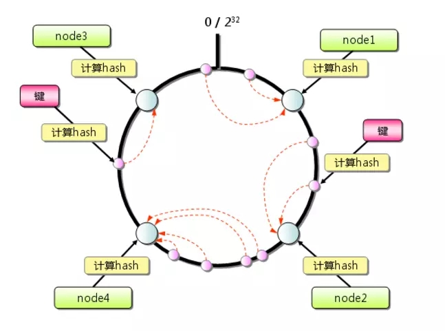
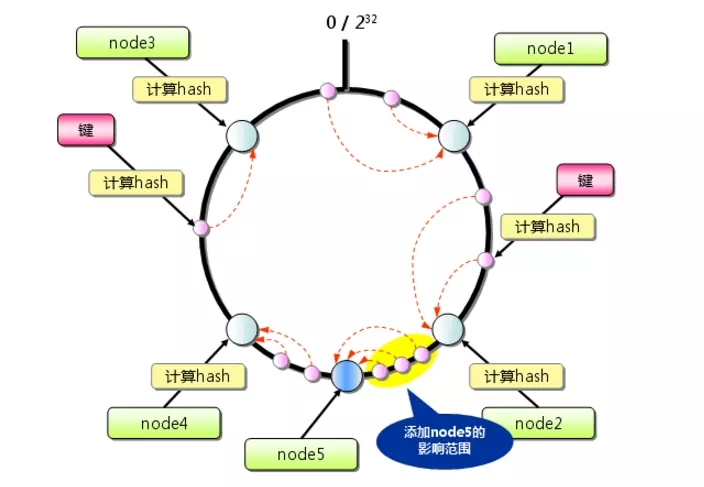
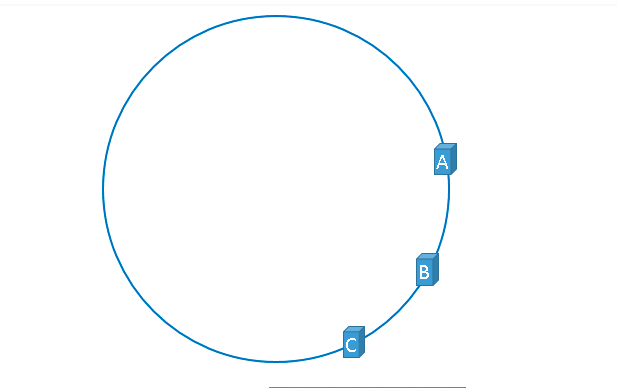
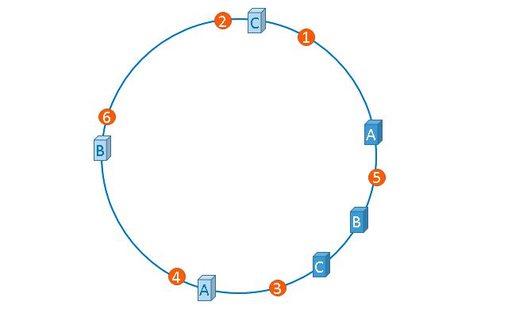

# .net

>修饰词 static、private、protect、sealed、readonly 、internal、volatile

	sealed ：密封的。修饰类可防止类被继承，修饰方法可防止方法被重写
	static : 静态，修饰类时，该类不能生成实例，修饰字段时，静态字段可以不适用实例来访问。
	volatile：英文翻译为不稳定的，该词修饰的变量能确保可见性，但不能确保原子性。

>static、private等特殊用法

	单例模式
>自定义类型转换 explicit、implicit

```csharp
public class Test
{
	public int size { get; set; }
	public Test(int size)
	{
		this.size = size;
	}
	//隐式转换，由其他类型转为当前类
	public static implicit operator Test(int i)
	{
		return new Test(1);
	}
	//显示转换(强制转换)，由当前类转换为其他类型
	public static explicit operator int(Test i)
	{
		return i.size;
	}
}
Test test= 1;
int i =(int)test;
```

> == 与 Equals 

	Equals比较的是相等性，==比较的是同一性（即是否是同一引用），但是很多类型都会有重写这两个操作，所以这两个语义已经混乱了。
	例子1：
	下面是.net中的Object类的一个静态方法，是用来对比同一性的。可以看出==是表示同一性。比较同一性最好使用该方法，或者是把对象转换为Object再进行比较。
	public class Object{
		public static Boolean ReferenceEquals（Object objA,Object objB）
		{
			return (objA==objB);
		}
	}
	例子2：
	下面代码中，test1,、test2进行装箱，装箱后的obj1,、obj2引用地址不一样了，但是值还是一样的，所以Equals方法返回的是true，表示相等性。后面两个操作返回的是false，表示同一性。
	进行装箱后，==操作调用的是object的操作，Equals操作调用的还是int类型的Equals。

	int test1 = 3;
	int test2 = 3;
	object obj1 = (object)test1;
	object obj2 = (object)test2;
	Console.WriteLine(obj1.Equals(obj2));//true
	Console.WriteLine(obj1 == obj2);//false
	Console.WriteLine(object.ReferenceEquals(obj1, obj2));//false
	

>LINQ中的TakeWhile和SkipWhile
	
	[
		{category:"mytest"}
		{category:"mytest"}
		{category:"mytest1"}
		{category:"mytest2"}
		{category:"mytest"}
	]
	testlist.TakeWhile(m=>m.category="mytest")
	结果:
	会获取到前两个值。第三个值与表达式不匹配，就不再继续匹配后面的值。
	testlist.SkipWhile(m=>m.category="mytest1")
	结果：
	会返回后三个值。查找到第一个匹配的值，返回它以及之后的值。


>值类型和引用类型

	引用类型是在堆中分配内存（字段所需内存、同步块索引、类型对象指针），栈中存储的是变量名和引用类型的引用地址。
	值类型是在栈中分配内存，但是在进行装箱操作时，会把值复制到堆中存储，并添加上同步块索引和类型对象指针（object类型的指针）。
	同步块索引是用来进行lock操作的，在进行lock操作的时候需要添加一个锁对象 lock（object），所以值类型是不能作为锁对象的。

>数组T[]、ArrayList、LinkedList<>、List<T> 原理、接口、优缺点


>泛型集合的实现原理


>LinkedList<T>和List<T>

	LinkedList<T>是使用链表来实现的，
	优点是新增和移除某个元素时比较方便，不用挪动其他元素的位置，也不用进行扩容。不过在获取某个元素时比较耗时，需要从链表的头结点开始往下找。

	List<T>是用数组实现
	在新增时，如果数组长度不够，需要扩容，在删除时，需要把删除的位置后面的元素往前挪动。在获取某个元素时，时间复杂度为常量级。


> foreach原理（延时）IEnumerator

>状态机

	foreach迭代器和async/await中都使用了状态机

>yield

	语法糖，编译时会自动生成一个实现了IEnumerator接口的类

>重载（Overload）和重写（Override）
	
	重载：方法名相同，函数声明不同
	复写：子类的方法覆盖父类的方法，要求方法名和参数相同，访问修饰符的限制一定要大于被重写方法的访问修饰符

>volatile原理

    volatile实现变量的可见性，不保证变量的原子性。
    原理：锁缓存区或者总线，在对volatile修饰的变量进行修改的时候，直接把修改结果写入内存中，
    所有缓存区中对于该变量的缓存都失效。这样就保证获取到的volatile变量的值都是最新的值。
>集合 List<T> ArrayList Dictionary HasSet 线程安全类(ConcurrentQueue等集合) 以及原理

>字符串池

>Array.Copy和Buffer.BlockCopy

>string.Cancat方法

```csharp
//四个以内的Concat操作都是如此，开辟出所有参数需要的内存
//然后逐个参数复制过去。
public static string Concat(string str0, string str1)
{
	if (string.IsNullOrEmpty(str0))
	{
		if (string.IsNullOrEmpty(str1))
		{
			return string.Empty;
		}
		return str1;
	}
	else
	{
		if (string.IsNullOrEmpty(str1))
		{
			return str0;
		}
		int length = str0.Length;
		//开辟一块新内存，长度为两个字符串长度之和
		string text = string.FastAllocateString(length + str1.Length);
		//把字符串1复制到新内存中，偏移量为0
		string.FillStringChecked(text, 0, str0);
		//把字符串2复制到新内存中，便宜量为字符串1的长度。
		string.FillStringChecked(text, length, str1);
		return text;
	}
}
[SecuritySafeCritical]
private unsafe static void FillStringChecked(string dest, int destPos, string src)
{
	if (src.Length > dest.Length - destPos)
	{
		throw new IndexOutOfRangeException();
	}
	fixed (char* ptr = &dest.m_firstChar)
	{
		fixed (char* ptr2 = &src.m_firstChar)
		{
			string.wstrcpy(ptr + destPos, ptr2, src.Length);
		}
	}
}
```

>string字符串连接，+、concat、string.Format()、StringBuilder

    1）+：  
    字符串+操作经过了重载，编译后是调用的Concat方法，如果+操作符操作的变量超过四个，会调用Concat(string[])/Concat(object[])方法，该方法内部是使用StringBuilder。如果是连续的常量，编译后直接会合并成一个常量赋值给变量。
	string test="123"+"456"+"789"+“0”;这段代码只会产生一个对象。
	编译后IL代码为IL_0088: ldstr "1234567890"
    2）Concat   

    有多个重载方法，
    参数中传入集合时，是使用StringBuilder对字符串进行操作
    其他时候是通过+操作符来连接字符串。

    3）string.Format()  

    使用StringBuilder的一个internal方法对string字符串进行操作

    internal StringBuilder AppendFormatHelper(IFormatProvider provider, string format, ParamsArray args)

    方法内部循环查找{}标记进行替换。
    注意：string.Format()也是会容易产生装箱操作。比如string result=string.Format(“{0}+{1}={2}”,1,2,3)  
    4）StringBuilder    

    内部维护一个char数组，默认是长度是16，也可以在初始化的时候定义长度，在进行Append操作时，如果发现长度大于数组长度，会进行扩容，把原来数组的数据拷贝到新数组上。

>装箱问题

    装箱一般说的是值类型，引用类型不会产生装箱操作。
    装箱操作是指将值类型转换为引用类型，装箱时，会进行一下几步操作
    1、在托管堆中分配内存。分配的内存是值类型的各个字段所需的内存量，还要加上托管堆所有对象都有的两个额外成员（类型对象指针和同步块索引）所需的内存量。
    2、值类型的字段复制到新分配的堆内存中。
    3、返回对象的地址。现在该地址是对象引用；值类型成了引用类型。


```csharp
public void Log(int id, int size，int test,int one ,int two)
{
    //通过下方IL代码可以看出，下面代码的装箱次数分别为
    //两次装箱（id和size）
    string result = string.Format("{0}:{1}", id, size);
    //两次装箱(':'和size)
    string result1= string.Concat(id.ToString(),':',size);
    //一次装箱 编译成IL时，':'会编译为字符串，可能是编译器处理过了，所以这里只产生一次装箱操作
    //这里还需要知道的是 +操作符经过编译器处理，会调用string.Concat()
    string result2=id.ToString() + ':'+size;
    //超过4个的字符串变量进行+号操作时，编译后是调用System.String::Concat(string[])，该方法是使用StringBuilder来进行字符串操作的。没有装箱操作
    string result3 = id.ToString() + size.ToString() + test.ToString() + one.ToString()+ two.ToString();

    //编译器会把连续的字符串常量直接连接起来，所以编译后的il其实只申请了一个字符串变量，只产生了一个对象。没有装箱操作
    string result4 = "123" + "456" + "789" + "0";
    //下面代码经编译器优化，只有三个对象，后面的"789"+"0"合并成了"7890"，没有装箱操作
    string result5 = "123"+ size.ToString() + "789" + "0";
}
//总地来说，感觉+号操作符已经被优化得和StringBuilder没啥区别了。
```

```IL
.method public hidebysig 
	instance void Log (
		int32 id,
		int32 size,
		int32 test,
		int32 one,
		int32 two
	) cil managed 
{
	// 方法起始 RVA 地址 0x2110
	// 方法起始地址（相对于文件绝对值：0x0310）
	// 代码长度 168 (0xa8)
	.maxstack 4
	.locals init (
		[0] string,
		[1] string,
		[2] string,
		[3] string,
		[4] string,
		[5] string
	)

	// 0x031C: 00
	IL_0000: nop
	// 0x031D: 72 1D 00 00 70
	IL_0001: ldstr "{0}:{1}"
	// 0x0322: 03
	IL_0006: ldarg.1
	// 0x0323: 8C 4C 00 00 01
	IL_0007: box [mscorlib]System.Int32
	// 0x0328: 04
	IL_000c: ldarg.2
	// 0x0329: 8C 4C 00 00 01
	IL_000d: box [mscorlib]System.Int32
	// 0x032E: 28 1D 00 00 0A
	IL_0012: call string [mscorlib]System.String::Format(string, object, object)
	// 0x0333: 0A
	IL_0017: stloc.0
	// 0x0334: 0F 01
	IL_0018: ldarga.s id
	// 0x0336: 28 1B 00 00 0A
	IL_001a: call instance string [mscorlib]System.Int32::ToString()
	// 0x033B: 1F 3A
	IL_001f: ldc.i4.s 58
	// 0x033D: 8C 4E 00 00 01
	IL_0021: box [mscorlib]System.Char
	// 0x0342: 04
	IL_0026: ldarg.2
	// 0x0343: 8C 4C 00 00 01
	IL_0027: box [mscorlib]System.Int32
	// 0x0348: 28 1C 00 00 0A
	IL_002c: call string [mscorlib]System.String::Concat(object, object, object)
	// 0x034D: 0B
	IL_0031: stloc.1
	// 0x034E: 0F 01
	IL_0032: ldarga.s id
	// 0x0350: 28 1B 00 00 0A
	IL_0034: call instance string [mscorlib]System.Int32::ToString()
	// 0x0355: 72 19 00 00 70
	IL_0039: ldstr ":"
	// 0x035A: 04
	IL_003e: ldarg.2
	// 0x035B: 8C 4C 00 00 01
	IL_003f: box [mscorlib]System.Int32
	// 0x0360: 28 1C 00 00 0A
	IL_0044: call string [mscorlib]System.String::Concat(object, object, object)
	// 0x0365: 0C
	IL_0049: stloc.2
	// 0x0366: 1B
	IL_004a: ldc.i4.5
	// 0x0367: 8D 4D 00 00 01
	IL_004b: newarr [mscorlib]System.String
	// 0x036C: 25
	IL_0050: dup
	// 0x036D: 16
	IL_0051: ldc.i4.0
	// 0x036E: 0F 01
	IL_0052: ldarga.s id
	// 0x0370: 28 1B 00 00 0A
	IL_0054: call instance string [mscorlib]System.Int32::ToString()
	// 0x0375: A2
	IL_0059: stelem.ref
	// 0x0376: 25
	IL_005a: dup
	// 0x0377: 17
	IL_005b: ldc.i4.1
	// 0x0378: 0F 02
	IL_005c: ldarga.s size
	// 0x037A: 28 1B 00 00 0A
	IL_005e: call instance string [mscorlib]System.Int32::ToString()
	// 0x037F: A2
	IL_0063: stelem.ref
	// 0x0380: 25
	IL_0064: dup
	// 0x0381: 18
	IL_0065: ldc.i4.2
	// 0x0382: 0F 03
	IL_0066: ldarga.s test
	// 0x0384: 28 1B 00 00 0A
	IL_0068: call instance string [mscorlib]System.Int32::ToString()
	// 0x0389: A2
	IL_006d: stelem.ref
	// 0x038A: 25
	IL_006e: dup
	// 0x038B: 19
	IL_006f: ldc.i4.3
	// 0x038C: 0F 04
	IL_0070: ldarga.s one
	// 0x038E: 28 1B 00 00 0A
	IL_0072: call instance string [mscorlib]System.Int32::ToString()
	// 0x0393: A2
	IL_0077: stelem.ref
	// 0x0394: 25
	IL_0078: dup
	// 0x0395: 1A
	IL_0079: ldc.i4.4
	// 0x0396: 0F 05
	IL_007a: ldarga.s two
	// 0x0398: 28 1B 00 00 0A
	IL_007c: call instance string [mscorlib]System.Int32::ToString()
	// 0x039D: A2
	IL_0081: stelem.ref
	// 0x039E: 28 23 00 00 0A
	IL_0082: call string [mscorlib]System.String::Concat(string[])
	// 0x03A3: 0D
	IL_0087: stloc.3
	// 0x03A4: 72 2D 00 00 70
	IL_0088: ldstr "1234567890"
	// 0x03A9: 13 04
	IL_008d: stloc.s 4
	// 0x03AB: 72 43 00 00 70
	IL_008f: ldstr "123"
	// 0x03B0: 0F 02
	IL_0094: ldarga.s size
	// 0x03B2: 28 1B 00 00 0A
	IL_0096: call instance string [mscorlib]System.Int32::ToString()
	// 0x03B7: 72 4B 00 00 70
	IL_009b: ldstr "7890"
	// 0x03BC: 28 24 00 00 0A
	IL_00a0: call string [mscorlib]System.String::Concat(string, string, string)
	// 0x03C1: 13 05
	IL_00a5: stloc.s 5
	// 0x03C3: 2A
	IL_00a7: ret
} // 方法 Program::Log 结束
```

>happens-before规则

# IO

>File Seek

指定流的指针位置。

```csharp
using (FileStream stream = new FileStream(filename, FileMode.OpenOrCreate))
{
	//把流指针指向流末尾偏移量为0的地方，也就是流末尾
	stream.Seek(0, SeekOrigin.End);
	//从当前指针出0偏移量的地方开始写入。
	stream.Write(buffer,0 , buffer.Length);
}

```

# 面向对象

>面向对象三个基本特征

	封装：抽象事务封装为类
	继承：代码重用，可以写一个类继承现有类的属性、字段、方法等，并扩展自己的方法。被继承类是父类，继承类是子类（派生类）
	多态：通过复写（覆盖）来实现多态。

# 设计模式
>用到了哪些，具体场景

    工厂模式、建造者模式（quartz）

>单例模式

    饿汉式单例模式
    懒汉式单例模式
    双检锁单例模式
    用intelock实现

>建造者模式

	用在复杂对象的构造


```csharp 


```


>观察者模式

# 五个同步问题的经典模型

>生产者-消费者模型

>哲学家就餐问题

>读者-写者问题

>熟睡的理发师问题

>三个烟鬼问题

# 多线程和并发类的相关知识

>进程和线程的状态（阻塞、挂起、就绪、运行、休眠）

>Thread、ThreadPool和Task的比较

>线程的分类

>多线程有什么用，优缺点。

    优点:
    (1)充分利用多核cpu资源

    (2)防止阻塞，
    当有多个任务时，用多线程可以避免某个任务异常时阻塞所有任务
    分时操作系统和实时操作系统，时间片

    缺点:
    (1) 使用不当反而会影响效率 
    当cpu是单核的时候，多个线程工作会频繁上下文切换。
    即便是多核cpu，线程太多也会频繁的上下文切换，这样反而会导致效率变慢。

    解决方案:线程池、Task
    (2) 如果某些资源是线程共享的，需要考虑线程安全问题
    解决方案：加锁,线程安全类，Intelock，Actor模型

>创建线程方式

    Thread类和ThreadStart类
    ThreadPool.QueueUserWorkItem

>线程优先级

    Highest
    AboveNormal
    Normal
    BelowNormal
    Lowest
    

>什么是线程安全

    如果你的代码在多线程下执行和在单线程下执行永远都能获得一样的结果，那么你的代码就是线程安全的。


>线程同步

    线程同步主要解决线程安全问题和速率限制。
    1、原子操作 Interlocked;
    2、Monitor
    3、lock():lock语句其实是Monitor的封装。
    4、cas+自旋
    5、ReaderWriterLock，这个主要用户读取频繁的时候。
    6、事件
        1）AutoResetEvent（自动重置事件）
        2）ManualResetEvent（手动重置事件）
    7、信号量Semaphore
        信号量可以用在tcp中，限制链接数量。
    8、互斥体Mutex

>线程间通讯

>什么是原子操作

>什么是自旋（SpinWait）

>自旋锁SpinLock

>什么是cas(compare and swap)

    cas是一种原子操作，很多cpu已经实现了这种原子操作，所以只需要调用cpu的指令就行了。
	c#中的cas的实现是InterLock

>获取线程dump文件

>为什么创建和销毁线程会开销很大

    1、线程内核对象
    2、线程环境块
    3、用户模式栈
    4、内核模式栈
    5、DLL线程连接和线程分离通知

>为什么使用线程池、线程池原理

    线程的创建和销毁是很耗费资源的，避免频繁地创建和销毁线程，达到线程对象的重用。另外，使用线程池还可以根据项目灵活地控制并发的数目;

>什么是上下文切换、跨核上下文切换

    windows的cpu（或者说内核）一个时间片只能分配给一个线程，时间片到期时，windows就把上下文切换到另一个线程。这个过程就是线程调度。期间发生发生如下事情。

    1、将cpu寄存器中的值保存到当前正在运行的线程的内核对象内部的一个上下文结构中。

    2、从现有线程集合中选出一个线程供调度。如果该线程由另一个进程拥有，windows在开始执行任务代码或接触任何数据之前，还必须要切换cpu"看见"的虚拟地址空间
    
    3、将所选线程的上下文结构中的值加载到cpu的寄存器中。
    
    4、新线程在高速缓存区可能没有数据，还需要访问RAM来填充高速缓存区，以恢复高速执行状态。

    跨核上下文切换代价更昂贵


>如果减少上下文切换

    windows在一下情况下会进行上下文切换

    1、时间片结束，下个时间片cpu分配的线程不是当前线程的时候，会进行上下文切换

    2、线程阻塞(锁、睡眠等)，重新调度线程，把cpu资源分配给其他线程。

    第一种情况开发者是无法干涉的，所以要从第二种情况入手，减少线程的阻塞。

    无锁并发编程：actor模型
    原子操作:Interlock相关类
    CAS算法:CAS算法加自旋操作
    协程：在单线程里实现多任务的调度，并在单线程里维持多个任务间的切换（个人理解，类似.NET Task类）


>什么是乐观锁和悲观锁

>Monitor、lock、AutoResetEvent、Semaphore、SemaphoreSlim、ReadWriteLock

>Semaphore和SemaphoreSlim区别

	Semaphore 表示一个命名或者本地型号量，维护的一个内核对象，所以是可以进程间共享的
	在初始化时，如果没有添加命名，就是本地信号量，只能进程内使用
	如果添加了命名，就是命名信号量，可以进程间共享。
	Semaphore semaphore = new Semaphore(4, 4, "Named_Semaphore");

	SemaphoreSlim不支持命名信号量，所以只能在进程内使用，支持异步操作。

>Thread.sleep()和SpinWait

>Thread.sleep(0)

    强制当前线程放弃剩余的 CPU 时间片，可能会产生上下文切换开销。
    也可以通过该方法，避免权重高的线程一直占用cpu资源，把资源分配给权重低的线程。

>线程调度算法

    抢占式


>线程间共享数据

>线程间通讯

>一个线程出现异常

    这种情况下，线程的异常是无法在主线程中捕获的，所以需要在线程内部捕获，否则会发生未捕获异常，程序就会蹦掉。

    用Task的情况向，await关键字 wait()、waitall()方法还有Result属性都是会把异常抛出到主线程中。只要在这些代码块中try{}catch{}就行了

>生产者消费者模型的作用是什么

    这个问题很理论，但是很重要：

    （1）通过平衡生产者的生产能力和消费者的消费能力来提升整个系统的运行效率，这是生产者消费者模型最重要的作用

    （2）解耦，这是生产者消费者模型附带的作用，解耦意味着生产者和消费者之间的联系少，联系越少越可以独自发展而不需要收到相互的制约


>Task和线程池

>ReadWriteLock

>编程写一个会导致死锁的程序


>Task.Run和Task.Factory.StartNew

	Task.Factory.StartNew的重载方法比较多，可以添加TaskCreateOption、TaskScheduler等参数，所以可以应对比较复杂情况。
	当回调函数返回值是Task或者Task<T>时，Task.Run会自动进行Unwrap操作，直接返回的是结果，而Task.Factory.StartNew不会进行Unwrap操作；

```csharp
Task<int> task = new Task<int>(() =>
{
	return 1;
});
//回调函数是Fun<Task<int>>,按理说Task.Factory.StartNew会返回Task<Task<int>>,所以前面需要两个await来操作
int startnew =await await Task.Factory.StartNew(()=> task);
int startnew = await Task.Factory.StartNew(()=> task).Unwrap();
int startnew =await Task.Factory.StartNew(()=> task.Result);
//回调函数是Fun<Task<int>>,按理说Task.Run会返回Task<Task<int>>,但由于进行了Unwrap，把Fun<Task<int>>的结果int提取出来了，所以Task.Run返回的是Task<int>
int i = await Task.Run(() =>task);
```

>Parallel进行并行计算
```csharp
List<int> list = new List<int> {  2, 3 ,4};
int result = list.AsParallel().Aggregate((i, j) =>
{
    return i+j;
});
object mutex = new object();
int sum = 1;
Parallel.ForEach(list,()=>1,
(item,state,localvalue) =>
{
    return item * localvalue;
},
localvalue => {
    lock (mutex)
    {
        sum=sum*i;
    }
});
```
**个人理解Parallel.ForEach**:

localvalue是计算结果，有可能多个任务分到同一个线程里，比如2,3分到一个线程里，
则会先处理2，此时localvalue为初始值1，计算完成后localvalue=item * localvalue=2;此时的localvalue
再传递到3的计算任务中，计算完成后localvalue=item * localvalue=6;这时的localvalue传递到第三个回调函数中
，计算后把值赋值给了sum。而值为4的任务在另一个线程里，这时候的localvalue为初始值1，重复刚才的过程，
最后又到第三个回调函数中，计算后把值赋值给sum

>Partitioner

# 框架

## web框架
### mvc
## orm框架

### Entity Framwork

>模式

	Code First :直接使用代码写类型，映射到数据库中
	Database First :从数据库生成ADO.NET实体模型
	Model First :创建空ADO.NET实体模型

>工作单元模式

>缓存机制

>多线程操作

[相关文章](https://blog.csdn.net/qq_29227939/article/details/51713422)

	由于ef的缓存机制问题，上下文不建议使用单例模式，最好同一个线程使用同一个上下文。


### dapper

## 定时器框架

### quartz
## 异常熔断框架
### polly


>日志(nlog、log4net)和日志门面接口

>日志门面接口使用了什么设计模式

	外观模式：
	适配器模式：
	适配器模式是为了适配不兼容接口。比较旧的日志接口可能跟如今比较流行的日志接口不一样，适配器模式可以适配两种接口，在不改动就日志接口的情况下，用新接口进行调用。

# 垃圾回收
>gc 垃圾回收算法

>类加载机制

>出现内存问题时定位方式

>idispose、析构方法close方法

# 缓存机制
>redis缓存的应用场景

	redis这类内存数据库使用用来存储一些临时数据，包括缓存、session等。并不适合用来作为持久化数据存储。

>缓存加载

## 缓存击穿、缓存雪崩、缓存穿透原因和相应解决方案

>缓存击穿：

	产生原因：大量请求进来访问同一个资源，如果该资源缓存过期了，这些请求可能同时访问数据库来更新缓存，导致数据库崩塌。
    解决方案：
	1）加锁或者其他同步模型，如Actor模型
	2）“提前”使用互斥锁
		值中设置一个过期时间，当发现已经过期时，延长过期时间并重新从数据库中获取数据更新缓存。
	3）永不过期
		后台定期更新时数据
	4）资源保护
		采用netflix的hystrix，可以做资源的隔离保护主线程池

>缓存雪崩：

	产生原因：大量缓存同时过期，使得大量请求同时访问数据库，导致数据库崩塌。
	解决方案：
	1）错开缓存过期时间。
	2）

>缓存穿透：

	产生原因：查询一个数据库中不存在的数据，由于数据库中不存在该数据，不会写入缓存，每次请求都会访问数据库。有人会利用这个来频繁攻击，导致数据库挂掉。
	解决方案：
	1）布隆过滤器：过滤掉不存在的数据，避免了数据库查询压力
	2）如果数据库中不存在该数据，这把null存入到缓存，下次请求就能从缓存中获取，从而避免频繁查询数据库。

>redis原理和高级功能


>redis集群原理

## 分布式缓存解决方案

>hash取余

	可以通过hash取余来解决分布式缓存问题，通过key的hash值的余数来确定缓存保存在那个服务器上
	比如服务器0、1、2、3
	key1的hash%4=1，则把key1存储在服务器1上

	缺点：在扩容和收获节点的时候，需要把大部分的缓存都重新分布

	解决方案：一致性hash

>一致性hash


原理：

一个0-2<sup>32</sup>的环形节点槽

根据服务器ip或者是物理地址进行hash，然后配置到环上。

采用同样的hash算法计算key的hash值，并映射到环上

从数据映射的顺时针查找服务器节点，存储在第一个服务器节点上。



新增服务器情况下



如图，只有node2-node5之间的数据需要重新分配，其他数据不变

收缩节点的时候也是类似。


哈希倾斜问题：


这种情况下，大部分的数据将会存储到节点A中，造成服务器A的压力变大。

解决方案：使用虚拟节点

如图 服务器A、B、C都进行两次hash，然后映射到环上，数据1，3都是分配到服务器A上。如果使用三次hash，数据会分配更均匀一些。


# 分布式

>什么是API网关

	API网关是一个服务器，是系统的唯一入口。从面向对象设计的角度看，它与外观模式类似。API网关封装了系统内部架构，为每个客户端提供一个定制的API。它可能还具有其它职责，如身份验证、监控、负载均衡、缓存、请求分片与管理、静态响应处理。
	API网关方式的核心要点是，所有的客户端和消费端都通过统一的网关接入微服务，在网关层处理所有的非业务功能。通常，网关也是提供REST/HTTP的访问API。服务端通过API-GW注册和管理服务。

**理解：** 也就是一个统一的api入口，这样就不用暴露微服务的服务地址给客户端。

>cap理论

	一致性（consistency）、可用性（Availability）、分区容错（partition-tolerance）不可兼得

>数据一致性的几种解决方案

>分布式事务/TCC(Try、Confirm、Cancel)

>分布式锁的实现

	redis：
	zookeeper：

>分库分表

>分布式session的实现

	分布式缓存（如redis）或者是数据库（nosql--mongodb）


>选举算法

>如何处理高并发

	负载均衡

>负载均衡的几种实现

>如何保证高可用

	集群

# web

>api网关

	api的门面接口，在分布式服务中，数据是分布在不同的服务器中的，比如说一个订单包含了用户、商品、订单、物流等信息，api网关的作用就是整合分布式服务器中的数据，然后以统一接口返回给客户端。

>url的构成

* protocol 协议，常用的协议是http
* hostname 主机地址，可以是域名，也可以是IP地址
* port 端口 http协议默认端口是：80端口，如果不写默认就是:80端口
* path 路径 网络资源在服务器中的指定路径
* parameter 参数 如果要向服务器传入参数，在这部分输入
* query 查询字符串 如果需要从服务器那里查询内容，在这里编辑
* fragment 片段 网页中可能会分为不同的片段，如果想访问网页后直接到达指定位置，可以在这部分设置

>get和post的区别

GET、POST、PUT、DELETE是一种规范约定，底层实现上没什么区别。

**安全性：** 对服务资源是安全的，也就是不会修改服务资源（包括数据库等）

**幂等性：** 多次操作结果是一样的。

GET用于信息获取，而且应该是安全的和幂等的。

POST表示可能修改变服务器上的资源的请求，是不安全和不幂等的。

PUT和DELETE是不安全的、幂等的

浏览器和服务器一般都会遵循这些规范，对不同类型请求做不同限制，所以导致GET和POST会产生应用上的差异。

* GET请求会被浏览器主动cache，而POST不会，除非手动设置。

* GET请求只能进行url编码，而POST支持多种编码方式。

* GET请求参数会被完整保留在浏览器历史记录里，而POST中的参数不会被保留。

* GET参数通过URL传递，POST放在Request body中。

* 虽然GET可以带request body，但不能保证一定能被接收到，有些服务器会忽略掉GET带的request body

* GET产生的URL地址可以被Bookmark，而POST不可以。

* GET产生一个TCP数据包；POST产生两个TCP数据包。但有些浏览器的POST也只产生一个TCP数据包

	对于GET方式的请求，浏览器会把http header和data一并发送出去，服务器响应200（返回数据）；

	而对于POST，浏览器先发送header，服务器响应100 continue，浏览器再发送data，服务器响应200 ok（返回数据）

	因为POST需要两步，时间上消耗的要多一点，看起来GET比POST更有效。因此Yahoo团队有推荐用GET替换POST来优化网站性能。但这是一个坑！跳入需谨慎。为什么？

	1. GET与POST都有自己的语义，不能随便混用。

	2. 据研究，在网络环境好的情况下，发一次包的时间和发两次包的时间差别基本可以无视。而在网络环境差的情况下，两次包的TCP在验证数据包完整性上，有非常大的优点。

	3. 并不是所有浏览器都会在POST中发送两次包，Firefox就只发送一次。	

* GET和POST理论上并不限制携带数据量的大小，但是浏览器或者系统会限制URL的大小，而有些服务器也会限制request body的大小

* GET只接受ASCII字符的参数的数据类型，而POST没有限制

>转发与重定向的区别

>跨域问题如何解决

>如何保证接口的幂等性

>Session和Cookie的区别和联系以及Session的实现原理

>http常用两种数据压缩方式

	1、gzip
	2、deflate

>[http实时数据获取（短轮询、长轮询、websocket）](https://www.cnblogs.com/xrq730/p/9280404.html)


# 中间件

>mq的作用和使用场景

>服务化治理框架的作用和使用场景

>配置中心的作用和使用场景

>zookeeper的作用和使用场景

# 数据结构

[连接](数据结构与算法.md)

# Sql Server

[连接](sql%20server.md)

# MVC

>FromBody、FromUri

	FromUri：表示参数是在uri中获取
	FromBody：表示参数是从请求的body中获取，表单数据也是在body中。

# 安全

>JWT (json web token)适用场景

# 正则表达式

>回溯